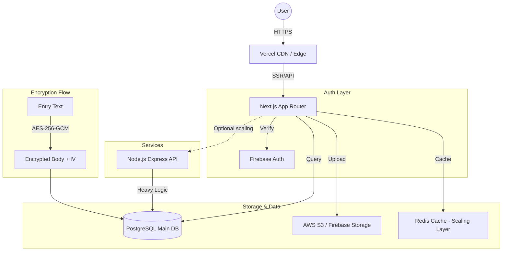

# DailyDiary.in - Detailed Hybrid Execution Process

## 🧠 Final Hybrid Product Vision
“A secure, habit-driven journaling platform with templates & gamification. Portfolio-ready, startup-capable, and fully monetizable.”

---

## 🔥 Updated Tech Stack
- **Frontend**: Next.js 15+ (App Router), Tailwind CSS, Zustand (State Management).
- **Backend**: Node.js + Express (API Layer).
- **Database**: PostgreSQL (Main) + Firestore (Initial Sync/Cache).
- **Storage**: AWS S3 / Firebase Storage (Images/Media).
- **Auth**: Firebase Auth (for stability) + JWT/Refresh Tokens for API security.
- **Security**: AES-256-GCM (Server-side first → Client-side for Premium).

---

## 🏗️ 5-Week Development Roadmap

### 🔵 WEEK 1: Core Backend & Auth
- **Setup**: Next.js Boilerplate + Node.js/Express Backend.
- **Database**: Initialize PostgreSQL schema.
- **Auth**: Firebase Auth integration with custom JWT middleware.
- **CRUD**: Basic entry creation (unencrypted).

### 🟢 WEEK 2: Core Features & media
- **Storage**: AWS S3/Firebase Storage integration for image uploads.
- **Visibility**: Implementation of Public vs. Private diaries.
- **Timeline**: Chronological feed and user dashboard.

### 🟡 WEEK 3: Template & Streak System 🔥
- **Templates**: `templates` table and JSONB field support.
- **Dynamic Forms**: React logic to render forms from JSON schemas.
- **Streaks**: Daily check-in logic and streak calculation in PostgreSQL.

### 🟠 WEEK 4: Gamification & Security
- **Challenges**: Implementation of the `challenges` and `user_challenges` engine.
- **Badges**: Trigger-based badge awards and profile trophy room.
- **Notifications**: Email reminders (SendGrid) and Web Push foundations.
- **Encryption**: AES-256-GCM implementation for entry bodies.

### 🔴 WEEK 5: Monetization & Polish
- **SEO**: Static generation for public diaries and marketing pages.
- **Ads**: Google AdSense integration.
- **Deployment**: Vercel (Frontend) + Render/Railway (Backend).

---

## 📊 Database Design (PostgreSQL)

### Existing/Core Tables
- `users`: Profile, preferences, streak_count.
- `entries`: user_id, template_id, body_encrypted, iv, is_public, created_at.
- `images`: url, entry_id, metadata.
- `trackers`: habit tracking metrics.

### New Feature Tables
- `templates`: `id`, `name`, `description`, `fields` (JSONB).
- `entry_responses`: `id`, `entry_id`, `field_label`, `value` (for structured data).
- `challenges`: `id`, `name`, `duration`, `description`.
- `user_challenges`: `user_id`, `challenge_id`, `current_day`, `completed`.
- `badges`: `id`, `name`, `icon`, `condition`.
- `user_badges`: `user_id`, `badge_id`, `awarded_at`.

---

## 🎨 System Architecture

---

## 💰 Monetization Strategy
- **Free**: Basic journaling, 3 basic templates, public feed access.
- **Premium**: Unlimited templates, AI insights, Client-side local encryption (Master Key), Ad-free browsing.
