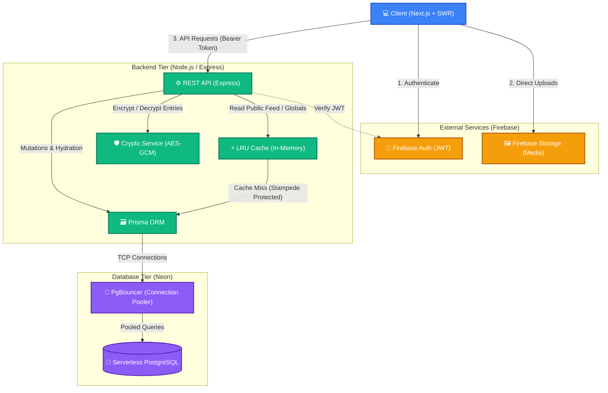

# DailyDiary High-Level Design (HLD)

The following diagram illustrates the architecture and data flow of the DailyDiary platform, incorporating the recent performance and caching optimizations.

### Component Breakdown

1. **Client (Next.js + SWR)**: The React frontend uses SWR for aggressive client-side caching of personalized data (like the Dashboard).
2. **Firebase Auth & Storage**: Handles user identity securely via JWTs. Images are uploaded directly from the client to Firebase Storage to offload bandwidth from the backend.
3. **Express REST API**: The core backend processing engine. It validates Firebase JWTs using the Firebase Admin SDK.
4. **LRU Cache**: A highly optimized in-memory cache protecting the database from burst traffic. It uses Promise-deduping (Stampede Protection) to ensure only a single database query executes when thousands of users hit an expired cache key simultaneously.
5. **Crypto Service**: Handles server-side AES-GCM encryption and decryption. Database entries are stored encrypted at rest, and only decrypted when mapping payloads for authenticated requests or the public feed.
6. **Database Tier**: Prisma ORM connects to a **Neon Serverless Postgres** database. Because serverless databases can struggle with high concurrent connection counts, **PgBouncer** is used as a middleware connection pooler to multiplex queries efficiently.
